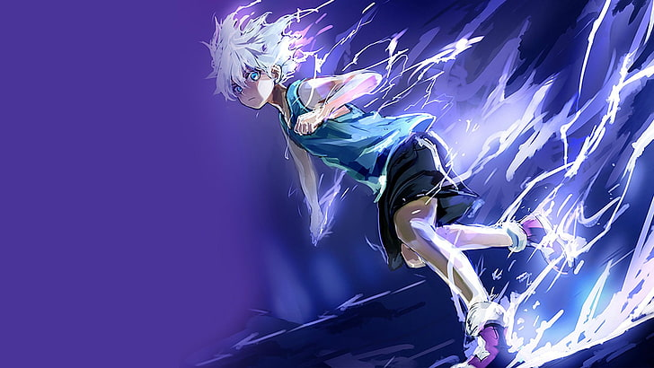

# Hi :alien:

## About me :snowman:

I have been
interested in learning something new. My passion is
programming.

I had been writing in C# and ASP.NET Core since high school. At the moment I'm and writing in
Laravel, Mysql, HTML, CSS stack and aiming to learn Vue JS soon.

It is a great way to spend my time and develop my
skills.

## Digital Skills :star2:

- HTML / CSS
- JavaScript / TypeScript / jQuery / Alpine.js
- Laravel / CodeIgniter / Phalcon
- MySql / PostgreSql / Redis
- PHP / C# / Java
- Docker
- Git

### Currently studying :books:

- Golang
- Spring

### I want to learn :pushpin:

- Rust
- Kafka
- MongoDB / Memcached
- Symfony

## Contact me :wave:

